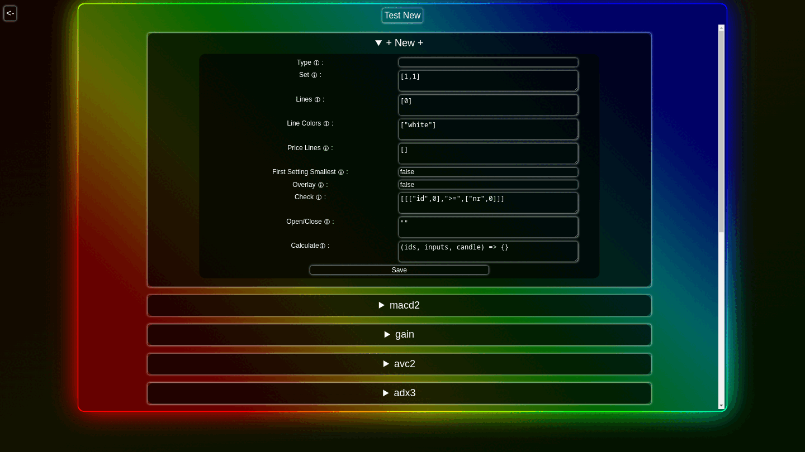
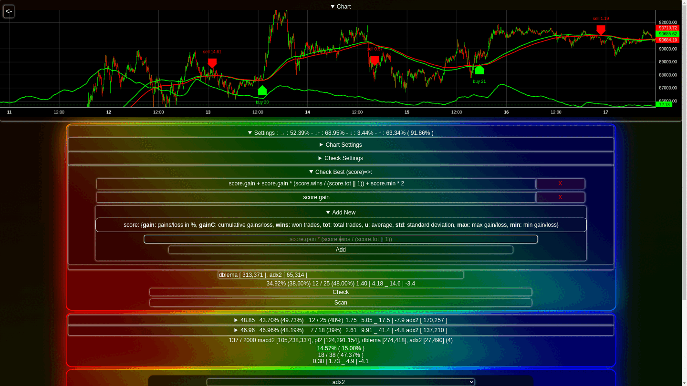
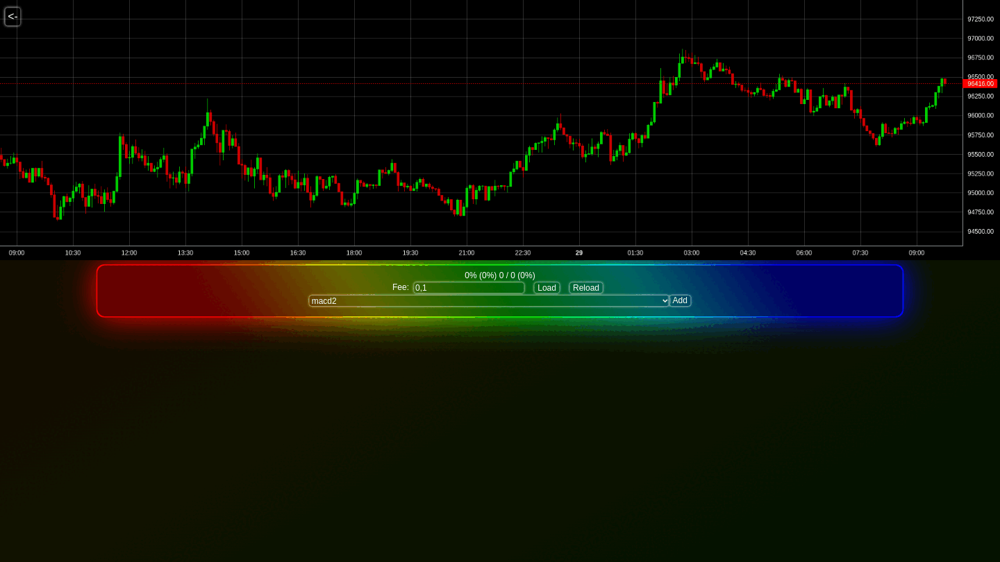
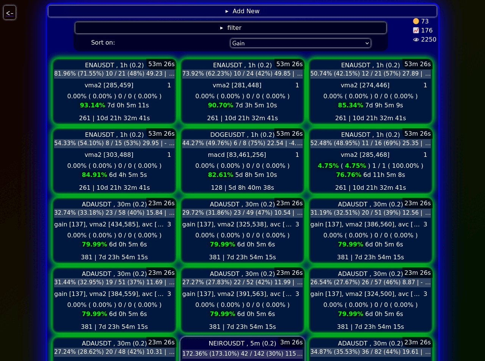
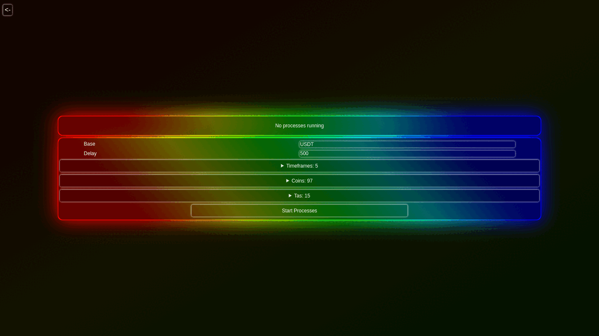

# Crypto Trader

Crypto Trader is a cryptocurrency trading bot that allows users to select from a range of existing TAs or create their own, (automatically) scan charts to identify the most effective combinations, and seamlessly integrate these strategies into a live trading environment.

## Features

-   **Custom Trading Strategies**: Choose from a variety of predefined technical analyses (TAs) or add your own.

-   **Chart Scanning**: Scan charts to backtest and discover the best combinations of TAs and settings to optimize profits.

-   **Automated Chart Scanning**: Start new processes to scan charts, select coins from the top 100, difrent timeframes and find strategies in the background.

-   **Live Testing**: Test promising strategies in real-time to evaluate their performance.

-   **Strategy Visualization**: Create and tweak trading strategies while visualizing how different TAs and settings impact performance, enabling you to fit your approach and maximize returns.

## Installation

To set up Crypto Trader, follow these steps:

1. Clone the repository:

    ```bash
     git clone https://github.com/gijs-d/Crypto-Trader.git
    ```

2. Navigate to the project directory:

    ```bash
    cd Crypto-Trader
    ```

3. Navigate to the project directory:

    ```bash
    npm install
    ```

4. Start the application:
    ```bash
    npm start
    ```

## Usage

Once the application is running, you can access the web interface at http://localhost:80.

## Screenshots







